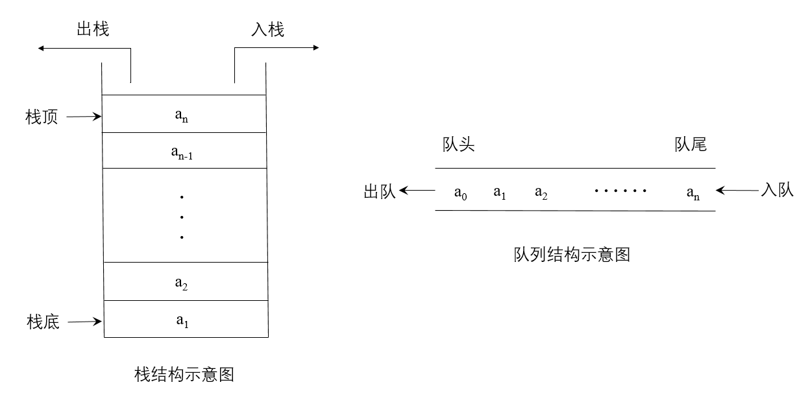
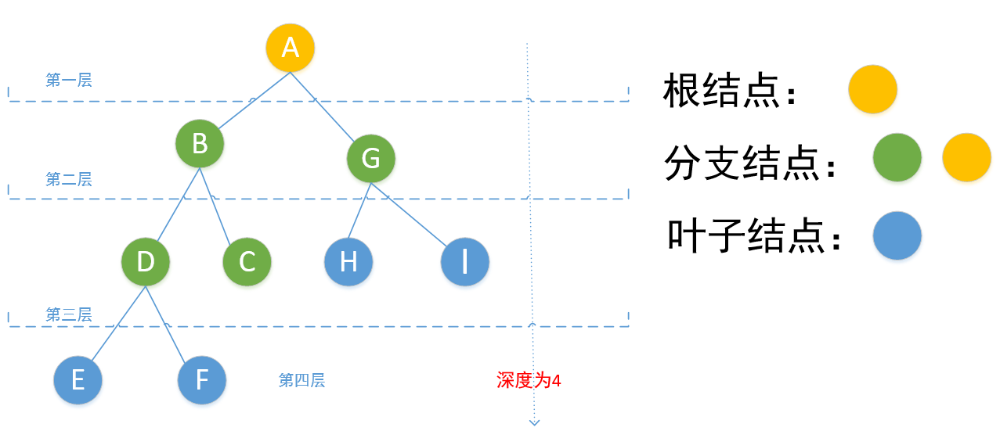

# Python程序员面试算法宝典

**ghs,2019-10.28**

&emsp;&emsp;本项目用于复现**猿媛之家**书籍《**Python程序员面试算法宝典**》中算法代码。书中代码采用Python2实现。本人参照作者思路，用Python3进行编程复现。


## 常用数据结构实现

&emsp;&emsp;本块主要列举书中所涉及到的数据结构的实现。其中都用Python进行编译。

| 对应章节 |             数据结构              |
| :------: | :-------------------------------: |
|    1     |           [链表](#链表)           |
|    2     | [栈、队列和哈希](#栈、队列和哈希) |
|    3     |         [二叉树](#二叉树)         |
|    4     |               数组                |
|    5     |              字符串               |
|    6     |           基本数字运算            |
|    7     |          排列组合与概率           |
|    8     |               排序                |
|    9     |              大数据               |


## 链表

&emsp;&emsp;在Python中，没有指针的概念，而类似指针的功能都是通过引用来实现的，为了方便理解，我仍使用指针来进行描述，而在实现的代码中，都是通过引用来建立结点之间的关系。

&emsp;&emsp;单链表数据结构的定义实例

```python
class LNode:
    def __init__(self,x):
        self.data = x
        self.next = None
```

&emsp;&emsp;另外，Python中没有数组的数据结构，但是列表和数组很像。本书代码中均采用列表来表示有序数组。

| 序号 |                         问题                         | 难度 |                             代码                             |                 原理                 |
| :--: | :--------------------------------------------------: | :--: | :----------------------------------------------------------: | :----------------------------------: |
|  1   |          [链表的逆序](ch1_list/Problems.py)          |  3   | 1.[就地逆序](ch1_list/1_1.py)2.[递归法](ch1_list/1_2.py)3.[插入法](ch1_list/1_3.py) |   [Reverse](ch1_list/thinking1.py)   |
|  2   |      [无序链表移除重复项](ch1_list/Problems.py)      |  3   |   1.[顺序删除](ch1_list/2_1.py)2.[递归法](ch1_list/2_2.py)   |   [Delete](ch1_list/thinking1.py)    |
|  3   |   [计算两个单链表表示数之和](ch1_list/Problems.py)   |  3   |                 [链表相加法](ch1_list/3.py)                  |    [Count](ch1_list/thinking1.py)    |
|  4   |        [链表的重新排序](ch1_list/Problems.py)        |  3   |               [中间结点逆序法](ch1_list/4.py)                |   [Reorder](ch1_list/thinking1.py)   |
|  5   |   [找出单链表的倒数第k个数](ch1_list/Problems.py)    |  3   |                 [快慢指针法](ch1_list/5.py)                  |    [Find](ch1_list/thinking2.py)     |
|  6   |      [检测单链表是否有环](ch1_list/Problems.py)      |  4   |               [快慢指针遍历法](ch1_list/6.py)                |    [Test](ch1_list/thinking2.py)     |
|  7   |      [把链表相邻元素翻转](ch1_list/Problems.py)      |  3   |                 [就地逆序法](ch1_list/7.py)                  |    [Flip](ch1_list/thinking2.py)     |
|  8   |  [把链表以K个结点为一组翻转](ch1_list/Problems.py)   |  3   |                   [翻转法](ch1_list/8.py)                    |    [Flip](ch1_list/thinking2.py)     |
|  9   |       [合并两个有序链表](ch1_list/Problems.py)       |  3   |                 [指针指向法](ch1_list/9.py)                  |    [Merge](ch1_list/thinking3.py)    |
|  10  | [给定某结点的指针，删除该结点](ch1_list/Problems.py) |  4   |               [复制数据删除法](ch1_list/10.py)               |   [Delete](ch1_list/thinking3.py)    |
|  11  |  [判断两个无环单链表是否交叉](ch1_list/Problems.py)  |  4   |                  [尾结点法](ch1_list/11.py)                  | [IsIntersect](ch1_list/thinking3.py) |
|  12  |         [展开链接列表](ch1_list/Problems.py)         |  4   |                   [归并法](ch1_list/12.py)                   |    [Merge](ch1_list/thinking3.py)    |


## 栈、队列与哈希

&emsp;&emsp;栈与队列是在程序设计中被广泛使用的两种重要线性数据结构，都是在一个特定范围的存储单元中存储的数据，这些数据可以重新被取出使用。

&emsp;&emsp;不同的是，栈先存进去的数据最后只能最后被取出来，是LIFO(Last In First Out，后进先出)，它将进行顺序逆序，即先进后出，后进先出；队列，先排队先买，后排队后买，是FIFO(First In First Out，先进先出)，它保持进出顺序一致，即先进先出，后进后出。



| 序号 |                        问题                        | 难度 |                             代码                             |                        原理                        |
| :--: | :------------------------------------------------: | :--: | :----------------------------------------------------------: | :------------------------------------------------: |
|  1   |       [实现栈](ch2_stack_queue/Problems.md)        |  3   | 1.[数组实现](ch2_stack_queue/1_1.py)2.[链表实现](ch2_stack_queue/1_2.py) |       [Stack](ch2_stack_queue/thinking1.md)        |
|  2   |      [实现队列](ch2_stack_queue/Problems.md)       |  3   | 1.[数组实现](ch2_stack_queue/2_1.py)2.[链表实现](ch2_stack_queue/2_2.py) |       [Queue](ch2_stack_queue/thinking1.md)        |
|  3   |       [翻转栈](ch2_stack_queue/Problems.md)        |  4   |                 [递归](ch2_stack_queue/3.py)                 |        [Flip](ch2_stack_queue/thinking1.md)        |
|  4   |    [判断出栈序列](ch2_stack_queue/Problems.md)     |  3   |               [模拟入栈](ch2_stack_queue/4.py)               |       [Array](ch2_stack_queue/thinking1.md)        |
|  5   | [求栈中最小元素(O(1))](ch2_stack_queue/Problem.md) |  4   |               [两栈结构](ch2_stack_queue/5.py)               |    [Double-Stack](ch2_stack_queue/thinking1.md)    |
|  6   | [用两个栈模拟队列操作](ch2_stack_queue/Problem.md) |  3   |              [插入弹出栈](ch2_stack_queue/6.py)              |    [Double-Stack](ch2_stack_queue/thinking2.md)    |
|  7   |    [设计排序系统](ch2_stack_queue/Problems.md)     |  4   |               [双向队列](ch2_stack_queue/7.py)               | [Double-ended queue](ch2_stack_queue/thinking2.md) |
|  8   |   [实现LRU缓存方案](ch2_stack_queue/Problems.md)   |  4   |           [双向队列和哈希表](ch2_stack_queue/8.py)           |    [deque、hash](ch2_stack_queue/thinking2.md)     |
|  9   | [从给定车票找出旅程](ch2_stack_queue/Problems.md)  |  3   |                [哈希法](ch2_stack_queue/9.py)                |        [Hash](ch2_stack_queue/thinking2.md)        |
|  10  | [数组中找出条件数对](ch2_stack_queue/Problems.md)  |  3   |               [字典法](ch2_stack_queue/10.py)                |        [Dict](ch2_stack_queue/thinking2.md)        |


## 二叉树

&emsp;&emsp;二叉树(Binary Tree)也称为二分数、二元树等，它是n个有限元素的集合，该集合或者为空、或者由一个称为根(root)的元素以及两个不相交、分别被称为左子树和右子树的二叉树组成。

&emsp;&emsp;二叉树的递归定义为：二叉树或者是一棵空树，或者是一颗由一个根结点和两棵互不相交的分别称作根结点的左子树和右子树所组成的非空树，左子树和右子树又同样都是一棵二叉树。

* 结点的度：结点所拥有的的子树的个数称为该结点的度。
* 叶子结点：度为0的结点称为叶子结点。
* 分支节点：度不为0的结点称为分支结点。
* 左孩子、右孩子、双亲：一个结点的子树的根结点称为这个结点的孩子，这个结点称为它孩子结点的双亲。具有同一个双亲的孩子结点互称为兄弟。
* 路径、路径长度：如果一棵树的一串结点n1、n2……nk有如下关系：结点ni是ni+1的父结点，就把n1、n2……nk称为一条由n1到nk的路径。这条路径的长度为k-1.
* 祖先、子孙：如果有一条路径从结点M到结点N，那么M就称为N的祖先，而N称为M的子孙。
* 结点的层数：规定树的根结点的层数为1，其余结点的层数等于它的双亲结点的层数加一。
* 树的深度：树中所有结点的最大层数称为树的深度。
* 树的度：树中各结点度的最大值称为该树的度。
* 满二叉树：在一棵二叉树中，如果所有的分支结点都存在左子树和右子树，并且所有叶子结点都在同一层上，这样的二叉树称作满二叉树。
* 完全二叉树：一棵深度为k的有n个结点的二叉树，对树中的结点按从上至下、从左至右的顺序进行编号，如果编号为i的结点和满二叉树中编号为i的结点在二叉树中的位置相同，则这棵二叉树称为完全二叉树。



&emsp;&emsp;二叉树的基本性质如下所示：

1. 一颗非空二叉树的第$i$层上最多有$ 2^{n-1} $个结点。
2. 一棵深度为$k$的二叉树中，最多具有$2 ^k -1$个结点，最少有$k$个结点。
3. 对于一棵非空的二叉树，度为0的结点总是比度为2的结点多一个，即如果叶子结点数为$n0$，度为2的结点数为$n2$，则有$n0 = n2 +1$。
4. 具有$n$个结点的完全二叉树的深度为「${log}_2 n$」+1。

&emsp;&emsp;二叉树有顺序存储和链式存储两种存储结构。

```python
class BiTNode:
    def __init__(self):
        self.data = None
        self.lchild = None
        self.rchild = None
```

| 序号 |                             问题                             | 难度 |                             代码                             |                     原理                      |
| :--: | :----------------------------------------------------------: | :--: | :----------------------------------------------------------: | :-------------------------------------------: |
|  1   |   [二叉树中放入有序整数数组](ch3_binary_tree/Problems.md)    |  4   |                 [递归](ch3_binary_tree/1.py)                 |   [Recursion](ch3_binary_tree/thinking1.py)   |
|  2   |    [从顶部逐层打印结点数据](ch3_binary_tree/Problems.md)     |  3   |                 [队列](ch3_binary_tree/2.py)                 |     [Queue](ch3_binary_tree/thinking1.py)     |
|  3   |      [二叉树的最大子树和](ch3_binary_tree/Problems.md)       |  4   |               [后序遍历](ch3_binary_tree/3.py)               |  [AfterOrder](ch3_binary_tree/thinking1.py)   |
|  4   |        [判断二叉树相等](ch3_binary_tree/Problems.md)         |  3   |                 [递归](ch3_binary_tree/4.py)                 |   [Recursion](ch3_binary_tree/thinking1.py)   |
|  5   |     [二叉树转换为双向链表](ch3_binary_tree/Problems.md)      |  4   |               [双向链表](ch3_binary_tree/5.py)               |     [List](ch3_binary_tree/thinking2.py)      |
|  6   | [判断数组是否是二元查找树后序遍历的序列](ch3_binary_tree/Problems.md) |  4   |               [后序遍历](ch3_binary_tree/6.py)               |  [AfterOrder](ch3_binary_tree/thinking2.py)   |
|  7   | [找出两个结点的最近共同父结点](ch3_binary_tree/Problems.md)  |  3   | 1.[路径对比](ch3_binary_tree/7_1.py)2.1.[结点编号](ch3_binary_tree/7_2.py) | [Route、Number](ch3_binary_tree/thinking2.py) |
|  8   |          [复制二叉树](ch3_binary_tree/Problems.md)           |  3   |                                                              |                                               |
|  9   |    [找出任意整数的所有路径](ch3_binary_tree/Problems.md)     |  4   |                                                              |                                               |
|  10  |     [对二叉树进行镜像反转](ch3_binary_tree/Problems.md)      |  3   |                                                              |                                               |
|  11  | [二叉排序树中找出第一个大于中间值的结点](ch3_binary_tree/Problems.md) |  4   |                                                              |                                               |
|  12  |       [找出路径最大的和](ch3_binary_tree/Problems.md)        |  4   |                                                              |                                               |
|  13  |      [实现反向DNS查找缓存](ch3_binary_tree/Problems.md)      |  4   |                                                              |                                               |

