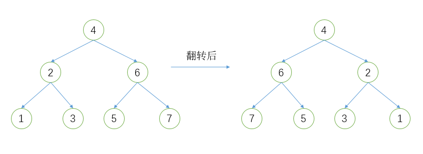

## 9.找出任意整数的所有路径

&emsp;&emsp;可以通过对二叉树的遍历找出所有的路径，然后判断各条路径上所有结点的值的和是否和给定的整数相等。具体实现方法可以通过对二叉树进行先序遍历来实现，实现思路为：对二叉树进行先序遍历，把遍历的路径记录下来，当遍历到叶子结点时，判断当前路径上所有结点数据的和是否等于给定的整数。

&emsp;&emsp;**性能分析**：这种方法和二叉树的先序遍历有着相同时间复杂度O(N)，这种方法用一个数组存放遍历路径上结点的值，最坏的情况下空间复杂度为O(N)。

## 10.对二叉树进行镜像反转

&emsp;&emsp;要实现二叉树的镜像反转，只需交换二叉树中所有结点的左右孩子即可。对所有的结点都做了相同的操作，可以用递归地方法来实现。打印时候用层序打印。

&emsp;&emsp;**性能分析**：由于对给定的二叉树进行了一次遍历，时间复杂度为O(N)。

## 11.二叉排序树中找出第一个大于中间值的结点

&emsp;&emsp;首先需要找出二叉排序树中的最大值和最小值。根据二叉排序树的特点，最小值一定是最左下的结点，最大值一定是最右下的结点。接下来对二叉树进行中序遍历，如果当前结点的值小于中间值，那么在这个结点的右子树中接着遍历，否则遍历这个结点的左子树。

&emsp;&emsp;**性能分析**：这种方法在查找最大结点与最小结点的时间复杂度为O(h)，h为二叉树的高度，对于有N个结点的二叉排序树，最大的高度为O(N)，最小的高度为O(log2N)。

## 12.找出路径最大的和

&emsp;&emsp;路径可以以任意结点为起点和终点，可以通过后序遍历来解决。

## 13.实现反向DNS查找缓存

